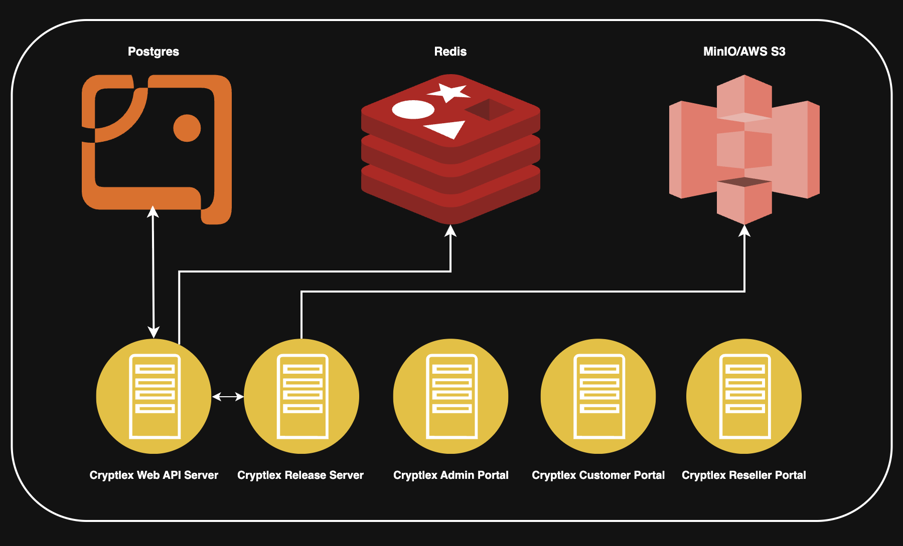

# Cryptlex On-Premise

Cryptlex On-premise offers a self-hosted version of Cryptlex for organizations that need or want to manage their own data. It can be run in your existing environments.

Cryptlex On-premise has all the features of SaaS Cryptlex and regular releases ensure you are kept up to date. All client libraries can easily be configured to send license activation requests to your Cryptlex On-premise instance.

## Server Layout

This configuration uses a single server to host all of the components for Cryptlex including the web portals. In this deployment model, there is no service redundancy and there is a risk of resource contention. For this reason, this model should be limited to the following purposes:

* Development servers or workstations
* Small production deployments

To find out more or discuss your requirements please contact [support@cryptlex.com](mailto:support@cryptlex.com).